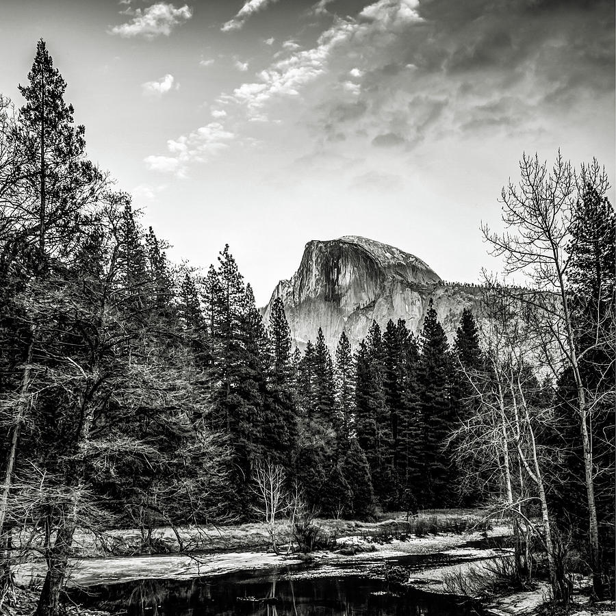

# 🎨 Black & White Image Colorization

An advanced deep learning project that automatically colorizes black and white images using a pre-trained neural network model. This project leverages the power of Caffe framework and OpenCV to bring old memories back to life with vibrant colors.

## ✨ Features

- **Automatic Colorization**: Transform grayscale images into full color
- **Pre-trained Model**: Uses sophisticated deep learning model for accurate colorization
- **Easy to Use**: Simple command-line interface
- **Support for Multiple Formats**: Works with various image formats (jpg, jpeg, png)

## 🛠️ Prerequisites

- Python 3.10.11
- OpenCV
- NumPy
- Required model files (provided via Dropbox)

## 🚀 Installation

1. Clone the repository:
```bash
git clone https://github.com/ramcharantejpuli/Colorization.git
cd Colorization
```

2. Install dependencies:
```bash
pip install -r requirements.txt
```

3. Download model files from [Dropbox Link](https://www.dropbox.com/scl/fi/9pktz9vbwdqmbny9sdzps/Model.zip?rlkey=xoxhlhbobboxm5zaet4m7ylvk&st=yl0ce3in&dl=0)
   - Extract and place these files in your project directory:
     - `colorization_deploy_v2.prototxt`
     - `colorization_release_v2.caffemodel`
     - `pts_in_hull.npy`

## 💡 Usage

Run the colorization script with your image:
```bash
python colorize.py -i images/your_image.jpg
```

## 📸 Example Results

### Historical Portrait
<div align="center">

</div>

### Nature Scene
<div align="center">

</div>

### Urban Landscape
<div align="center">

</div>

## 🙏 Credits

This implementation is based on the research and work by:
- [Rich Zhang's Colorization Project](http://richzhang.github.io/colorization/)
- [Original GitHub Repository](https://github.com/richzhang/colorization/)

## 👨‍💻 Author

Created with ❤️ by **Puli Ram Charan Tej**

## 📝 Note

Make sure to adjust the model file paths in `colorize.py` according to your local setup before running the script.
